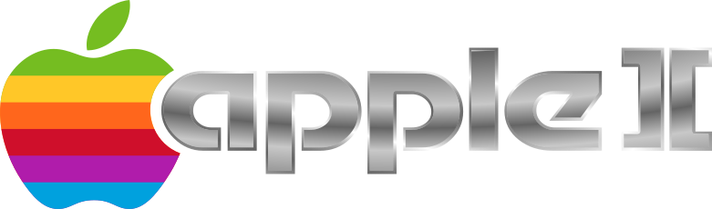

[](https://jitpack.io/#umjammer/vavi-apps-appleii)
[](https://github.com/umjammer/vavi-apps-appleii/actions/workflows/maven.yml)
[](https://github.com/umjammer/vavi-apps-appleii/actions/workflows/codeql.yml)

[](https://github.com/umjammer/umjammer/blob/wiki/QuickMVC.md)

# vavi-apps-appleii

 <sub>&nbsp;&nbsp;<a href="https://www.apple.com/">© Apple Inc.</a></sub>

Apple II emulator for Java

### chips

| type | name    | status |
|------|---------|:------:|
| cpu  | MOS6502 |   ✅️   |

### disk types

| type | name | status |
|------|------|:------:|
| dsk  |      |   ✅️   |
| nib  |      |   ✅️   |

## Install

 * [maven](https://jitpack.io/#umjammer/vavi-apps-appleii)

## Usage

### config

* ~/.config/appleiigo/appleii.properties

```properties
cpuRom=APPLE2E.ROM             # rom for the emulator
displayColorMode=1             # 0: green, 1: color
displayScale=4                 # scale for the app window size
#cpuDebugEnabled=true
#displayStatMode=true
cpuSpeed=2000
displayRefreshRate=10
#cpuStepMode=true
diskDrive1=LodeRunner.dsk      # drive 1
#diskDrive2=Tetris II.dsk      # drive 2
```

#### Input Mode Change

NORMAL - `F13` → DIRECT - `F13` → DISK1 - `F13` → DISK2 - `F13` → NORMAL

   * NORMAL ... game mode: numpad (as cursor key) + cursor (as gamepad) + space, z (as gamepad button 1) + enter, x (as gamepad button 2)
   * DIRECT ... keyboard direct
   * DISK1 ... disk1 selection: cursor up, down (disk changing), enter (disk selection), space, z (disk removing) 
   * DISK2 ... disk2 selection: ditto

## References

 * [original](https://web.archive.org/web/20070217131635/http://www-personal.umich.edu/~mressl/appleiigo/)
 * https://www7b.biglobe.ne.jp/~izushi/OTN/tn1/tn1Apple2.html
 * https://github.com/sicklittlemonkey/AppleIIGo (po readable)
 * https://github.com/AppleCommander
 * https://github.com/zellyn/diskii
 * https://github.com/apple2abandonware/abandonware (romz)
 * ftp://ftp.apple.asimov.net/pub/apple_II/
 * https://github.com/sicklittlemonkey/AppleIIGo (v1.0.10)
 * https://www.a2desktop.com/
 * https://github.com/badvision/jace (can read nib correctly)


## TODO

 * ~~extract osd for audio~~
 * .po, .shk, .sdk reader ... apple commander?
 * sound

---

# [Original](https://github.com/sicklittlemonkey/AppleIIGo)

Apple //e emulator Java applet

Original version: Copyright 2006 Marc S. Ressl, with parts adapted from code by

* Steven E. Hugg
* Doug Kwan
* Randy Frank
* Ben Koning

Subsequent versions: Copyright 2008-2015 Nick Westgate